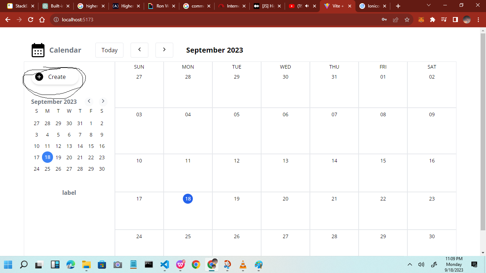

# My Vite + React Calendar App


## Introduction

Welcome to my Vite + React Calendar App! This application is designed to help users manage their schedules efficiently by providing an intuitive and customizable calendar experience. This README will provide an overview of the project, explain the contents of various files, and discuss design choices made during development.

## Usage

This section provides an overview of how to use the Calendar App and its key features. Please follow the instructions below to get started

### Installation

To run this calendar app locally, follow these steps:

1. Clone the repository:

   ```bash
   git clone https://github.com/moAbayomi/cs50Project.git
   ```

2. Navigate to the app directory:

   ```bash
   cd calendar-app
   ```

3. Install dependencies:

   ```bash
   npm install
   ```

4. Then start the development server:

   ```bash
   npm run dev
   ```

5. Open your browser and visit http://localhost:5173 to view the app.


## Key Features

1. **Creating Events**

There's a number of ways that one could create a event in this calendar application

- Clicking on the Create Event button would create an event for the current date.




- Another way is the user clicking directly into the grid where they would like to make a new event


2. **Editing Events**

The user can just click on an existing event and the modal would come up with the form. Previous inputs can rhen be edited.


3. **Deleting Events**

Similar to edit. In that user clicks on desired event in the grid and the modal cokmes up with the form. Only this time the trash icon is clicked on to DELETE the event.


## Project Structure

### `src` Folder

- `App.js`: The App.js file is a crucial component in the Calendar App. It serves as the main entry point for the application and orchestrates the rendering of various components that make up the calendar interface.

  #### Dependencies

  -`getMonth` (imported from `util.js`): `getMonth` is a utility function used to retrieve the current or specified month's data. It's used to initialize and update the `currentMonth` state.

  -`React`: `React` is the JavaScript library used for building user interfaces and managing component-based architecture.

  Various components: The application imports and renders several components, including `Header`, `Sidebar`, `Month`, and `EventModal`. These components contribute to the overall functionality and user interface of the calendar app.

  #### State Management

  -`currentMonth` (useState): This state variable stores the current month's data and is updated when the `monthIndex` changes. It ensures that the displayed calendar reflects the selected month.

  -`monthIndex` and `showEventModal` (useContext): These variables are accessed from the `GlobalContext` using the `useContext` hook. `monthIndex` represents the currently displayed month in the calendar, and `showEventModal` controls the visibility of the event creation/editing modal.

  #### useEffect Hook

  - The `useEffect` hook is used to update the `currentMonth` state when the `monthIndex` changes. This ensures that the calendar displays the correct month based on user interactions.

  -`monthIndex` and `showEventModal` (useContext): These variables are accessed from the `GlobalContext` using the `useContext` hook. `monthIndex` represents the currently displayed month in the calendar, and `showEventModal` controls the visibility of the event creation/editing modal.

  #### Rendering Components

  The `App` component renders several child components within the div with the class `h-screen flex flex-col`. These components include:

  `CreateEventButton.jsx`: This component is responsible for rendering the application's header, which likely contains navigation controls and branding.

  `Sidebar`: The sidebar component, which likely contains additional functionality or navigation options.

  `Month`: This component displays the calendar grid and events for the selected month.

  `EventModal`: This component is conditionally rendered based on the showEventModal state variable and is responsible for displaying event creation and editing forms.

  #### Overall Structure

  The `App` component follows a structured layout for your calendar app, with a header, sidebar, and the main calendar view. The main calendar view is represented by the `Month` component.

- `components` Folder: Contains reusable React components used throughout the app, such as:

  - `CreateEventButton.jsx`: When a user clicks this button, it will trigger an action that shows or opens a modal for creating events, thanks to the state or function provided by the GlobalContext.
  - `Day.jsx`: This component is responsible for displaying a single day within a calendar grid, showing its date, events, and providing interactions to view and select events for that day. It relies on the GlobalContext for managing global state related to events.
  - `EventModal.jsx`: This component provides a user interface for creating or editing calendar events, allowing users to set event details such as title, description, date, and label color. It interacts with the global context to manage and display events.
  - `Labels.jsx``: This component provides a user interface for managing labels used in the calendar application. Users can check or uncheck labels to apply them to calendar events. The state of the labels is managed through the global context using the updateLabel function.
  - `Month.jsx`: The Month component takes a two-dimensional array representing the days of a calendar month and renders them in a grid layout. It maps over the rows and days within each row, rendering the Day component for each day. The structure of the month prop allows for flexible rendering of calendar months with varying numbers of days and rows.
  - `Sidebar.jsx`: The Sidebar component is used to display various UI elements in a sidebar layout. It adapts its visibility based on the screen size, hiding on medium-sized screens and showing on larger screens. The components it renders, such as the event creation button, small calendar, and labels, provide functionality for managing events or tasks within the application's user interface.
  - `SmallCalendar.jsx`: The SmallCalendar component provides a user-friendly way to display and navigate through a small calendar view. Users can select a date, and the component communicates with the global context to update the selected date and month across the application.

- `context` Folder: Houses the utility files which contain functions for context used in the application.

  - ContextWrapper Component
    The ContextWrapper component is a crucial part of the Calendar App. It serves as a context provider, managing various aspects of the application's state and interactions.

  - GlobalContext module.
    The GlobalContext module is a critical part of our Vite + React Calendar App. It provides a context that encapsulates various state variables and functions used across the application.

  #### State Management

  `monthIndex` and `setMonthIndex`

        - `monthIndex` represents the index of the currently displayed month in the calendar. It defaults to the current month.
        - `setMonthIndex` is a function to update the monthIndex.

  `smallCalendarMonth` and `setSmallCalendarMonth`

        `smallCalendarMonth` stores the selected month in the small calendar view.
        `setSmallCalendarMonth` allows setting the smallCalendarMonth, which, in turn, updates the displayed month.

  `daySelected` and `setDaySelected`

        `daySelected` represents the currently selected day in the calendar.
        `setDaySelected` is used to update the selected day.

  `showEventModal` and `setShowEventModal`

        `showEventModal` controls the visibility of the event creation/editing modal.
        `setShowEventModal` allows showing or hiding the modal.

  `selectedEvent` and `setSelectedEvent`

        `selectedEvent` stores information about the currently selected event.
        `setSelectedEvent` is used to update the selected event.

  `labels` and `setLabels`

        `labels` is an array that holds label information for categorizing events.
        `setLabels` is used to update the labels array.

  `savedEvents` and `dispatchCallEvent`

        `savedEvents` represents the list of events saved by the user.
        `dispatchCallEvent` is a reducer function for manipulating the savedEvents state.

###### Filtering Events

The `filteredEvents` variable is computed using the useMemo hook to filter events based on selected labels.

###### Local Storage

Local storage is used to persist the user's events. The initEvents function initializes the savedEvents state with data retrieved from local storage, if available. Changes to savedEvents are automatically synchronized with local storage using the useEffect hook.

###### Update Labels

The updateLabel function is used to update the checked state of labels, allowing users to filter events by category.

###### GlobalContext Provider

The ContextWrapper component wraps its children with a GlobalContext.Provider, providing access to various state variables and functions through the context.

- `App.css` File: The CSS styles provided in this section define the visual appearance of your Vite + React Calendar App. These styles play a crucial role in creating a user-friendly and aesthetically pleasing interface.

- `index.css` : contains directives in the project's CSS file, which enable Tailwind CSS to generate the necessary CSS styles based on the utility class usage and configuration.

  - `@tailwind base;`: This directive includes the base styles provided by Tailwind CSS. Base styles typically consist of elements like typography, form elements, and other fundamental styles that create a consistent foundation for the project.

  - `@tailwind components;`: This directive includes the styles for Tailwind CSS components. Components in Tailwind CSS refer to pre-designed, reusable UI elements that can be used in the project. Examples include buttons, cards, and navigation bars.

  - `@tailwind utilities;`: This directive includes the utility classes provided by Tailwind CSS. Tailwind CSS is known for its utility-first approach, where you can apply small, single-purpose classes to HTML elements to style them. Utility classes can be used for things like margins, padding, text alignment, and more.

- `main.jsx`: Overall, this code sets up the necessary dependencies, imports your components and styles, and renders your application within the DOM element with the ID "root." It's a standard structure for a React application entry point.

- `util.js` : This function essentially provides a way to generate a matrix of dates for a specified month or the current month, which can be used for rendering a calendar view in the application. The matrix can then be mapped to create the calendar grid in the UI.

  - `import dayjs from "dayjs"`;: This line imports the dayjs library, which is used for working with dates and times.

  - `export function getMonth(month = dayjs().month()) {`: This defines a named export function called getMonth. It accepts an optional month parameter, which by default is set to the current month if not provided.

  #### Inside the function:

  - `month = Math.floor(month);`: This line ensures that the month parameter is treated as an integer.

  - `const year = dayjs().year();`: This line gets the current year using dayjs.

  - `const firstDayOfTheMOnth = dayjs(new Date(year, month, 1)).day();`: This calculates the day of the week (0 for Sunday, 1 for Monday, etc.) on which the 1st day of the specified month falls.

  - `let currentMonthCount = 0 - firstDayOfTheMOnth;`: This initializes a `currentMonthCount` variable, which will be used to generate the days of the month. It starts from a negative value based on the first day of the month.

  - `const daysMatrix = new Array(5).fill([]).map(() => {...});`: This creates a matrix with 5 rows and 7 columns, representing a calendar grid. Each cell in the grid will contain a dayjs object representing a specific date.

  Inside the map function, `currentMonthCount++` is used to increment the day count for each cell, and a dayjs object is created for that date.

  Finally, return `daysMatrix;` returns the matrix containing dayjs objects for each day of the month.

### Other Files

- `.eeslintrc.cjs`: This configuration file helps maintain consistent code quality and style in your JavaScript project, especially in combination with React.

- `.gitignore`: This .gitignore file helps keep the Git repository clean by excluding unnecessary or generated files and directories from being tracked by version control. It's a good practice to include such a file in a project to avoid cluttering your repository with files that can be easily regenerated or are specific to your development environment.

- `package-lock.json`: it helps maintain a stable and predictable development environment by specifying and recording exact dependency versions.

- `package.json`: the `package.json` file provides the necessary information for managing and building the application, along with its dependencies. It's common practice to include this file in version control so that other developers working on the project can easily set up their development environment with the same dependencies

- `postcss.config.js`: This configuration file `postcss.config.js` tells PostCSS to use these two plugins; namely "Tailwind CSS" and "autoprefixer". It assumes that Tailwind CSS and Autoprefixer are configured separately in the project.

- `tailwind.config.js`: This provides an overview of the Tailwind CSS configuration files and offers guidance on how to use and customize it for your project.

- `vite.config.js`: the vite.config.js file sets up the Vite build tool for the project, and in this specific case, it includes the Vite React plugin to enhance the development experience when building React applications with Vite.

## Design Choices

- **React for User Interface**: React was chosen for building the user interface due to its component-based architecture and the ability to efficiently manage state changes.

- **Vite for Development**: Vite was selected as the build tool because of its fast development server and quick build times, which enhance the development experience.

- **Tailwind CSS for Styling**: Tailwind CSS was used for styling the application, providing utility classes that simplify the styling process and maintain consistency.

- **Component Reusability**: To maintain clean and modular code, React components were organized into separate files. This promotes reusability and simplifies maintenance.

- **CSS Modules**: The project uses CSS Modules for styling components, ensuring scoped styles and reducing the chances of CSS conflicts.

- **Intuitive User Experience**: The app aims for an intuitive user experience by providing clear navigation, easy event creation, and a visually pleasing calendar interface.

## Features

- **Intuitive Interface:** A user-friendly interface makes scheduling easy for everyone.

- **Event Management:** Create, edit, and delete events with ease.

- **Customization:** Personalize your calendar with themes and event categories.
